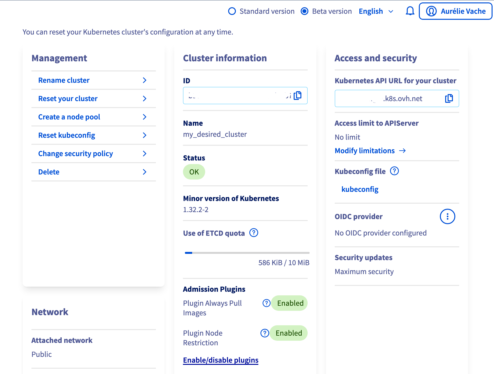
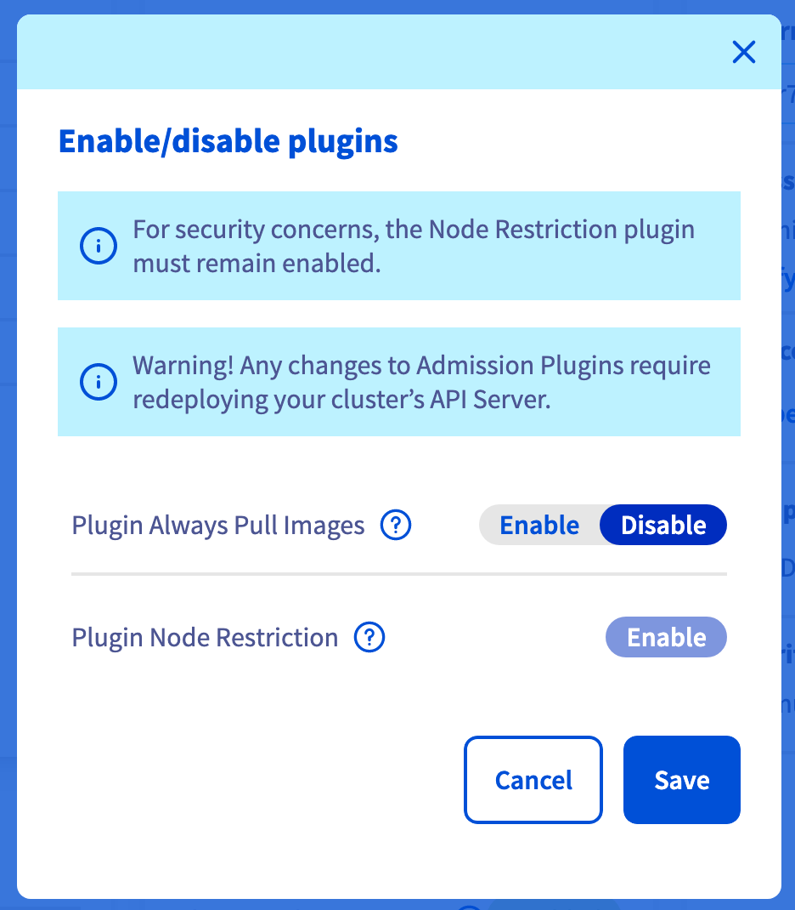
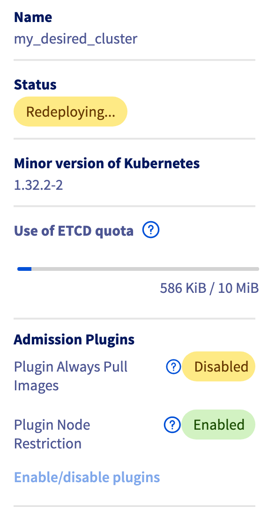

# Disable the AlwaysPullImages admission plugin on your MKS cluster

By default, the AlwaysPullImages Kubernetes admission plugin is enabled in your OVHcloud Managed Kubernetes (MKS) cluster.

⚠️ When it is enabled, this forces the imagePullPolicy of a container to be set to Always, no matter how it is specified when creating the resource.

This is useful in a multitenant cluster so that users can be assured that their private images can only be used by those who have the credentials to pull them. Without this admission controller, once an image has been pulled to a node, any pod from any user can use it by knowing the image’s name (assuming the Pod is scheduled onto the right node), without any authorization check against the image.

But, it can cause a lot of pull requests to the Docker Hub and you can reach the rate limits.

So a solution can be to deactivate the AlwaysPullImages admission plugin in your MKS cluster.

## Enable/Disable MKS admission plugins

Log in the OVHcloud Control Panel. In the left sidebar, click on the Managed Kubernetes Service and then click on the wanted MKS cluster.

In the Cluster information section, scroll down and click on Enable/disable plugin. A popup will appear.

Then click on Disable for the Always Pull Images plugin and click on the Save button.

⚠️ Any changes on the Admission plugins require a redeployment of the MKS cluster API server (without data loss) so the API server can be potentially not available during the redeployment.

