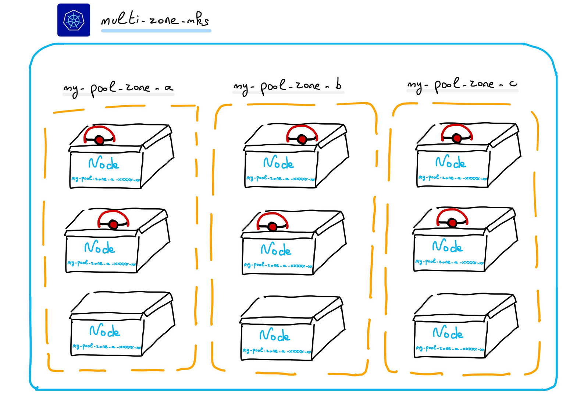

## Deploy apps in 3AZ



### Setup

  - Deploy a MKS cluster
  - Install the kubectl CLI
  - Install the kustomize CLI

### Demo

  - set the environment variables:

```bash
# OVHcloud provider needed keys
export PRIVATE_REGISTRY_URL="xxx"
export PRIVATE_REGISTRY_USER="xxx"
export PRIVATE_REGISTRY_PASSWORD="xxx"
export PRIVATE_REGISTRY_PROJECT="xxx"
export PRIVATE_REGISTRY_URL_WITHOUT_SCHEME=${PRIVATE_REGISTRY_URL#*//}

export KUBE_CLUSTER="xxx"
```

  - Create the Secret

```bash
kubectl --kubeconfig=$KUBE_CLUSTER create secret docker-registry ovhregistrycred \
    --docker-server=$PRIVATE_REGISTRY_URL \
    --docker-username=$PRIVATE_REGISTRY_USER \
    --docker-password=$PRIVATE_REGISTRY_PASSWORD
```

  - Check the secret has been correctly deployed in your Kubernetes cluster:

```bash
kubectl --kubeconfig=$KUBE_CLUSTER get secret ovhregistrycred -o jsonpath="{.data.\.dockerconfigjson}"
```

  - Edit the app's image with the created registry and project

```bash
cd overlays/prod

kustomize edit set image hello-ovh="${PRIVATE_REGISTRY_URL_WITHOUT_SCHEME}/${PRIVATE_REGISTRY_PROJECT}/hello-ovh:1.0.0-linuxamd64"
```

 - Deploy an app (linked to the created private registry)

We will deploy a deployment with the following content:

```yaml
apiVersion: apps/v1
kind: Deployment
metadata:
  name: hello-ovh-deployment
spec:
  replicas: 6
  template:
    spec:
      affinity:
        nodeAffinity:
          requiredDuringSchedulingIgnoredDuringExecution:
            nodeSelectorTerms:
            - matchExpressions:
              - key: "topology.kubernetes.io/zone"
                operator: In
                values:
                - eu-west-par-a
                - eu-west-par-b
                - eu-west-par-c
      containers:
      - name: hello-ovh
        image: hello-ovh:1.0.0
      imagePullSecrets:
      - name: ovhregistrycred
```

```bash
kustomize build . | kubectl --kubeconfig=$KUBE_CLUSTER apply -f -
```

Thanks to the nodeAffinity feature of Kubernetes, we declare that we want 6 replicas (pods) running in 3 zones: eu-west-par-a, eu-west-par-b, eu-west-par-c.

  - Check the app is running correctly (and image have been pulled successfully)

```bash
kubectl --kubeconfig=$KUBE_CLUSTER get po -l app=hello-ovh
kubectl --kubeconfig=$KUBE_CLUSTER describe po -l app=hello-ovh 
```

As you can see, 6 pods have been created, and they are running on the nodes located in the 3 AZ.
```bash
$ kubectl get po -o wide -l app=nginx-cross-az -n hello-app
NAME                             READY   STATUS    RESTARTS   AGE    IP             NODE                         NOMINATED NODE   READINESS GATES
hello-ovh-6ffd957c4-7528p   1/1     Running   0          6s     10.240.2.140   my-pool-zone-b-tr6wf-5wfgz   <none>           <none>
hello-ovh-6ffd957c4-96mnh   1/1     Running   0          6s     10.240.3.91    my-pool-zone-c-wgrl6-b2f9s   <none>           <none>
hello-ovh-6ffd957c4-b48cv   1/1     Running   0          115m   10.240.6.182   my-pool-zone-c-wgrl6-lp22l   <none>           <none>
hello-ovh-6ffd957c4-k7rwf   1/1     Running   0          115m   10.240.1.237   my-pool-zone-b-tr6wf-ct7fs   <none>           <none>
hello-ovh-6ffd957c4-pb7zp   1/1     Running   0          115m   10.240.8.195   my-pool-zone-a-b9ztj-gt5vd   <none>           <none>
hello-ovh-6ffd957c4-vhhcw   1/1     Running   0          6s     10.240.7.40    my-pool-zone-a-b9ztj-brgpq   <none>           <none>
```

  - Display the result

```bash
export SERVICE_URL=$(kubectl --kubeconfig=$KUBE_CLUSTER get svc hello-ovh -o jsonpath='{.status.loadBalancer.ingress[].ip}')

curl $SERVICE_URL
```