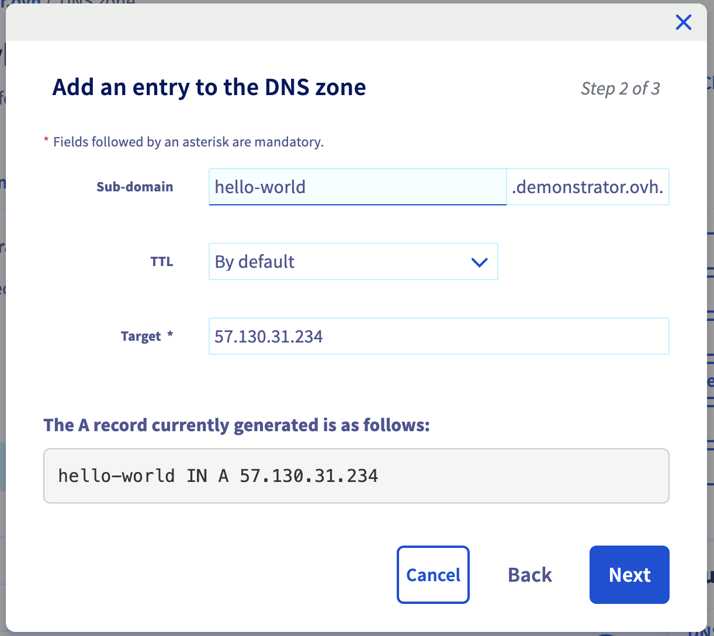

# Nginx Ingress Controller

## Instalation

```bash
helm repo add ingress-nginx https://kubernetes.github.io/ingress-nginx
helm repo update

helm -n ingress-nginx install ingress-nginx ingress-nginx/ingress-nginx --create-namespace
```

Result:
```bash
$ helm -n ingress-nginx install ingress-nginx ingress-nginx/ingress-nginx --create-namespace
NAME: ingress-nginx
LAST DEPLOYED: Mon Jul 21 13:41:36 2025
NAMESPACE: ingress-nginx
STATUS: deployed
REVISION: 1
TEST SUITE: None
NOTES:
The ingress-nginx controller has been installed.
It may take a few minutes for the load balancer IP to be available.
You can watch the status by running 'kubectl get service --namespace ingress-nginx ingress-nginx-controller --output wide --watch'

An example Ingress that makes use of the controller:
  apiVersion: networking.k8s.io/v1
  kind: Ingress
  metadata:
    name: example
    namespace: foo
  spec:
    ingressClassName: nginx
    rules:
      - host: www.example.com
        http:
          paths:
            - pathType: Prefix
              backend:
                service:
                  name: exampleService
                  port:
                    number: 80
              path: /
    # This section is only required if TLS is to be enabled for the Ingress
    tls:
      - hosts:
        - www.example.com
        secretName: example-tls

If TLS is enabled for the Ingress, a Secret containing the certificate and key must also be provided:

  apiVersion: v1
  kind: Secret
  metadata:
    name: example-tls
    namespace: foo
  data:
    tls.crt: <base64 encoded cert>
    tls.key: <base64 encoded key>
  type: kubernetes.io/tls
```

As the LoadBalancer creation is asynchronous, and the provisioning of the load balancer can take several minutes, you will surely get a <pending> EXTERNAL-IP.

```bash
kubectl get svc -n ingress-nginx ingress-nginx-controller
```

If you try again in a few minutes you should get an EXTERNAL-IP.

Result:

```bash
$ kubectl get svc -n ingress-nginx ingress-nginx-controller
NAME                       TYPE           CLUSTER-IP    EXTERNAL-IP     PORT(S)                      AGE
ingress-nginx-controller   LoadBalancer   10.3.162.74   57.130.28.169   80:32395/TCP,443:32451/TCP   2m34s
```

You can then access your nginx-ingress at http://[YOUR_LOAD_BALANCER_IP] via HTTP or https://[YOUR_LOAD_BALANCER_IP] via HTTPS.

Enter the following command to retrieve it:

```bash
export INGRESS_IP=$(kubectl get svc ingress-nginx-controller -n ingress-nginx -o jsonpath='{.status.loadBalancer.ingress[].ip}')
echo $INGRESS_IP
```

## Usage

### Deploy an ingress

Deploy A simple echo app and its ingress on your cluster:

```bash
kubectl apply -f echo.yaml
```

Result:

```bash
$ kubectl apply -f echo.yaml

namespace/echo created
deployment.apps/echo-deployment created
service/echo-service created
ingress.networking.k8s.io/echo-ingress created
```

Wait until the ADDRESS field of your Ingress contains the LB IP:
```bash
$ kubectl get ingress -n echo -w
NAME           CLASS   HOSTS   ADDRESS   PORTS   AGE
echo-ingress   nginx   *                 80      15s
echo-ingress   nginx   *       57.130.31.234   80      60s
```

Test:

```bash
curl $INGRESS_IP
```

Result:

```bash
$ curl $INGRESS_IP
{
  "path": "/",
  "headers": {
    "host": "57.130.31.234",
    "x-request-id": "bf3035c7762338a68874b7305034f617",
    "x-real-ip": "10.240.2.84",
    "x-forwarded-for": "10.240.2.84",
    "x-forwarded-host": "57.130.31.234",
    "x-forwarded-port": "80",
    "x-forwarded-proto": "http",
    "x-forwarded-scheme": "http",
    "x-scheme": "http",
    "user-agent": "curl/8.7.1",
    "accept": "*/*"
  },
  "method": "GET",
  "body": "",
  "fresh": false,
  "hostname": "57.130.31.234",
  "ip": "10.240.2.84",
  "ips": [
    "10.240.2.84"
  ],
  "protocol": "http",
  "query": {},
  "subdomains": [],
  "xhr": false,
  "os": {
    "hostname": "echo-deployment-577f888948-xprp2"
  },
  "connection": {}
}
```

⚠️ `x-real-ip` field is not the real IP of the client.

### Secure it through cert-manager

Follow [cert-manager README file](../../cert-manager/README.md) to install cert-manager on your Kubernetes cluster.

Deploy an hello-world application:

```bash
kubectl apply -f hello-world.yaml
```

Result:
```bash
$ kubectl apply -f hello-world.yaml

namespace/hello-world created
deployment.apps/hello-world-deployment created
service/hello-world created

$ kubectl get pod,svc -l app=hello-world -n hello-world
NAME                                          READY   STATUS    RESTARTS   AGE
pod/hello-world-deployment-58c6f884bf-twrbh   1/1     Running   0          29s

NAME                  TYPE        CLUSTER-IP   EXTERNAL-IP   PORT(S)   AGE
service/hello-world   ClusterIP   10.3.17.82   <none>        80/TCP    29s
```


⚠️ Replace `YOUR_DN` fields in the `hello-world-ingress-tls.yaml` file with your real Domain Name!

Apply the Ingress file with SSL/TLS configuration:

```bash
kubectl apply -f hello-world-ingress-tls.yaml
```

At this step, a Certificate resource has been created:

```bash
$ kubectl get certificate -n hello-world
NAME              READY   SECRET            AGE
hello-world-tls   False   hello-world-tls   17s
```

You can display the events of the certificate to check if the certificate has been correctly created and if it creates the necessary CertificateRequest:

```bash
$ kubectl describe certificate -n hello-world
Name:         hello-world-tls
Namespace:    hello-world
Labels:       <none>
Annotations:  <none>
API Version:  cert-manager.io/v1
Kind:         Certificate
Metadata:
  Creation Timestamp:  2025-07-21T14:14:02Z
  Generation:          1
  Owner References:
    API Version:           networking.k8s.io/v1
    Block Owner Deletion:  true
    Controller:            true
    Kind:                  Ingress
    Name:                  ingress
    UID:                   13fca52c-51f6-46d0-bd36-113049ed8f4e
  Resource Version:        1714045
  UID:                     91fe60cd-b3e4-49f7-954d-7ace3204b8d0
Spec:
  Dns Names:
    hello-world.demonstrator.ovh
  Issuer Ref:
    Group:      cert-manager.io
    Kind:       ClusterIssuer
    Name:       letsencrypt-prod
  Secret Name:  hello-world-tls
  Usages:
    digital signature
    key encipherment
Status:
  Conditions:
    Last Transition Time:        2025-07-21T14:14:02Z
    Message:                     Issuing certificate as Secret does not exist
    Observed Generation:         1
    Reason:                      DoesNotExist
    Status:                      False
    Type:                        Ready
    Last Transition Time:        2025-07-21T14:14:02Z
    Message:                     Issuing certificate as Secret does not exist
    Observed Generation:         1
    Reason:                      DoesNotExist
    Status:                      True
    Type:                        Issuing
  Next Private Key Secret Name:  hello-world-tls-nksst
Events:
  Type    Reason     Age   From                                       Message
  ----    ------     ----  ----                                       -------
  Normal  Issuing    89s   cert-manager-certificates-trigger          Issuing certificate as Secret does not exist
  Normal  Generated  89s   cert-manager-certificates-key-manager      Stored new private key in temporary Secret resource "hello-world-tls-nksst"
  Normal  Requested  89s   cert-manager-certificates-request-manager  Created new CertificateRequest resource "hello-world-tls-1"
```

Check CertificateRequest, Order and Challenge:

```bash
kubectl describe certificaterequest -n hello-world
kubectl describe order -n hello-world
kubectl describe challenge -n hello-world
```

You now need to map the Domain Name (DN) and the Load Balancer. In order to do this, create an A-record for [YOUR_DN] (your domain name ;-) mapped to the value of $INGRESS_IP.

Example:



Wait until the challenge is resolved:

```bash
dig +short [YOUR_DN]
```

Wait and check again the CertificateRequest:

```bash
kubectl describe certificaterequest -n hello-world
```

Result:
```bash
$ kubectl describe certificate -n hello-world
Name:         hello-world-tls
Namespace:    hello-world
Labels:       <none>
Annotations:  <none>
API Version:  cert-manager.io/v1
Kind:         Certificate
...
Events:
  Type    Reason     Age   From                                       Message
  ----    ------     ----  ----                                       -------
  Normal  Issuing    9m5s  cert-manager-certificates-trigger          Issuing certificate as Secret does not exist
  Normal  Generated  9m5s  cert-manager-certificates-key-manager      Stored new private key in temporary Secret resource "hello-world-tls-nksst"
  Normal  Requested  9m5s  cert-manager-certificates-request-manager  Created new CertificateRequest resource "hello-world-tls-1"
  Normal  Issuing    37s   cert-manager-certificates-issuing          The certificate has been successfully issued
```

Finally, check is cert-manager have created the Kubernetes Secret with the certificate:

```bash
kubectl get secret -n hello-world
```

If you found an `hello-world-tls` secret of type `kubernetes.io/tls`, you've done! 🎉

### Have access to real client IP in applications

By default, when deploying services through a LoadBalancer, the LB act as a proxy, so the remote address of an application will be the IP of the LB, not the client/source IP of the request.

The solution is to preserve the source IP.

```yaml
controller:
  service:
    externalTrafficPolicy: "Local"
    annotations:
      # For Managed Kubernetes Service version < 1.31
      #service.beta.kubernetes.io/ovh-loadbalancer-proxy-protocol: "v2"
      # For Managed Kubernetes Service version >= 1.31
      loadbalancer.openstack.org/proxy-protocol : "v2"
  config:
    use-proxy-protocol: "true"
    real-ip-header: "proxy_protocol"
    # For Public network
    # kubectl get svc ingress-nginx-controller -n ingress-nginx -o jsonpath="{.metadata.annotations.lb\.k8s\.ovh\.net/egress-ips}"
    #proxy-real-ip-cidr: "aaa.aaa.aaa.aaa/32,bbb.bbb.bbb.bbb/32,ccc.ccc.ccc.ccc/32,ddd.ddd.ddd.ddd/32"
    # For private network
    proxy-real-ip-cidr: "xx.yy.zz.aa/nn" #your subnet range
```

⚠️ Replace the subnet of the Private Network of your MKS cluster in the `real-ip-values.yaml` file!

Patch your Nginx Ingress Controller:

```bash
helm upgrade ingress-nginx ingress-nginx/ingress-nginx -n ingress-nginx -f real-ip-values.yaml
```

Wait several seconds.

We can now deploy a simple echo service to verify that everything is working. The service will use the `mendhak/http-https-echo` image, a very useful HTTPS echo Docker container for web debugging.

Deploy `echo` app and ingress on your cluster (if you don't already deploy it):

```bash
kubectl apply -f echo.yaml
```

Now you can test it using the LoadBalancer URL:

```bash
export INGRESS_IP=$(kubectl get svc ingress-nginx-controller -n ingress-nginx -o jsonpath='{.status.loadBalancer.ingress[].ip}')
echo $INGRESS_IP

curl $INGRESS_IP
```

And you should get the HTTP parameters of your request, including the right source IP in the `x-real-ip` header:

```bash
$ curl $INGRESS_IP
{
  "path": "/",
  "headers": {
    "host": "57.130.31.234",
    "x-request-id": "891c73bbb85248fa74c3de04d0267cec",
    "x-real-ip": "109.190.254.33",
    "x-forwarded-for": "109.190.254.33",
    "x-forwarded-host": "57.130.31.234",
    "x-forwarded-port": "80",
    "x-forwarded-proto": "http",
    "x-forwarded-scheme": "http",
    "x-scheme": "http",
    "user-agent": "curl/8.7.1",
    "accept": "*/*"
  },
  "method": "GET",
  "body": "",
  "fresh": false,
  "hostname": "57.130.31.234",
  "ip": "109.190.254.33",
  "ips": [
    "109.190.254.33"
  ],
  "protocol": "http",
  "query": {},
  "subdomains": [],
  "xhr": false,
  "os": {
    "hostname": "echo-deployment-577f888948-xprp2"
  },
  "connection": {}
```
